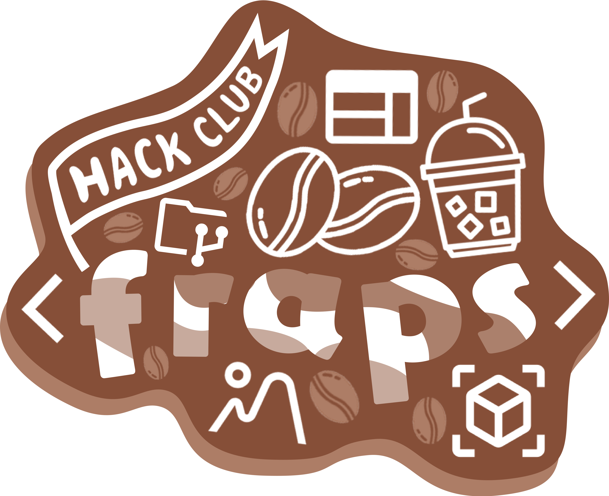

# Stickers

This repository contains some stickers I've made, inspired by a workshop which happened in [HackClub](https://hackclub.com/) which I didn't visit. They worked in Figma, but I prefer Photoshop, which is why the stickers are in PSD and PNG formats. You will find two folders here. "hackclub" folder includes stickers related to HackClub and its projects, and "other" folder contains miscellaneous stickers.

## HackClub

This folder includes stickers related to Hackclub and its projects. Each sticker is available in PSD and PNG formats. Here are the stickers you will find:

- Sprig - https://sprig.hackclub.com/

  

- Onboard - https://hackclub.com/onboard/

  

- Blot - https://blot.hackclub.com/

  

- The Bin - https://hackclub.com/bin/

  

- Fraps (Hackaccino) - https://fraps.hackclub.com/

  

## Other

This folder contains stickers that are not related to HackClub. Also available in PSD and PNG formats.

## Notes

Please note that the PSD files are quite messy.
